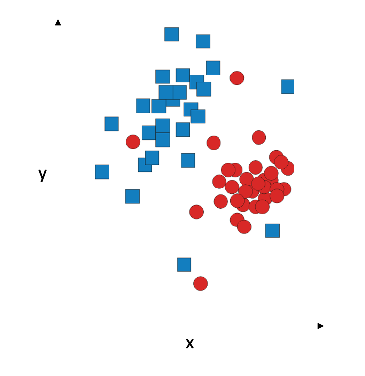

Let's discuss the problem of multivariate classification. "Multivariate" means that we have more than one input variable, and we will 
consider the interaction between the input variables when we classify them. For simplicity, we assume we have two input variables, x and y. For
this two-dimensional case, we can plot the data graphically. Let's say we have two classes; we will represent them with blue squares and red circles.

Many classifiers attempt to solve the classification problem by coming up with the *decision boundary*: the line (straight or curved) that separates the two classes from each other. This separation does not have to be perfect; in fact, if you try to have a perfect separation using a complex curve, you might end up with overfitting:

A more robust strategy is to be OK that we won't have 100% accuracy on the training set, and try to create a decision boundary which is a straight line or a low-degree polynomial.

Historically, the first classifier was designed by Ronald Fisher in 1936; it is now called Fisher's Linear Discriminant, or simply Linear Discriminant. He made the assumption that the two classes are both sampled from two-dimensional Gaussian distribution:

