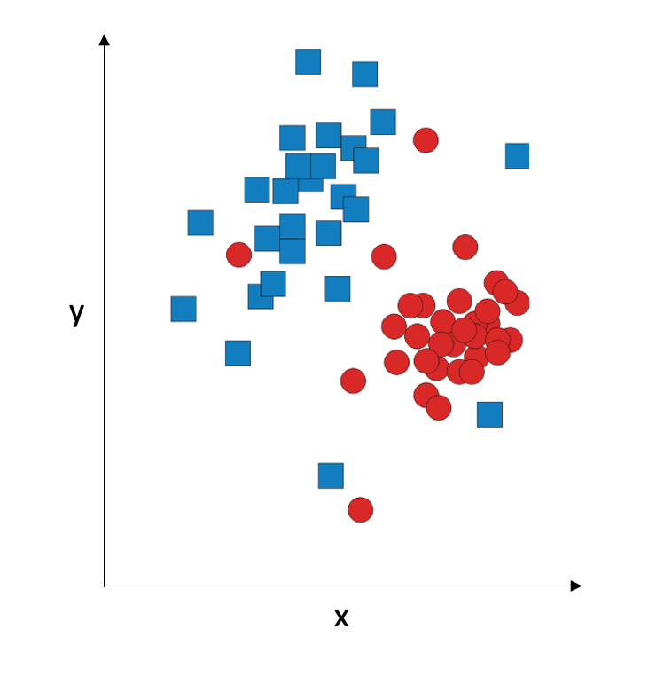

## K-Nearest Neighbour

Nearest-neighbour classification is very simple and intuitive. Consider a two-dimensional graphical representation of our data:



The idea is: given a point (an observation), we assign it to the same class as its nearest neighbour. So there is no training, and in the testing phase, we compute the [Euclidean distances](https://en.wikipedia.org/wiki/Euclidean_distance) to all training data points and assign the observation to the same class as the training data point which is the closest. So it is really fast, but it only works on data where classes form very tight clusters:


If the clusters are less tight, the performance suffers; if the classes overlap, the performance gets really bad. This method is extremely sensitive to outliers and to noisy data.

It is possible to stabilize it, by considering not just the nearest neighbour, but a set of nearest neighbours. We can assign it to the class that gets the majority votes of 3 nearest neighbours, or 6 nearest neighbours. The number of nearest neighbours to be used is denoted with K; choise of K might impact our classification:


So, what is the best K? There is no general answer because it depends on the data. K is called the [hyperparameter](https://en.wikipedia.org/wiki/Hyperparameter_(machine_learning)) of the classifier: 


It works really fast, but the performance is usually pretty bad. 


- Simplicity but powerful and fast for certain task
- Work for both classification and regression
- Named as Instance Based Learning; Non-parametrics; Lazy learner
- Work well with small number of inputs


### 13.1 Explanation


- In KNN, the most important parameter is the K group and the distance computed between points.
- Euclide distance:


### 13.2 Implementation
```r
library(caret)
data(iris)
set.seed(123)
indT <- createDataPartition(y=iris$Species,p=0.6,list=FALSE)
training <- iris[indT,]
testing  <- iris[-indT,]

ModFit_KNN <- train(Species~.,training,method="knn",preProc=c("center","scale"),tuneLength=20)

ggplot(ModFit_KNN$results,aes(k,AccuracySD))+
      geom_point(color="blue")+
      labs(title=paste("Optimum K is ",ModFit_KNN$bestTune),
           y="Error")
      
predict_KNN<- predict(ModFit_KNN,newdata=testing)
confusionMatrix(testing$Species,predict_KNN)
```


